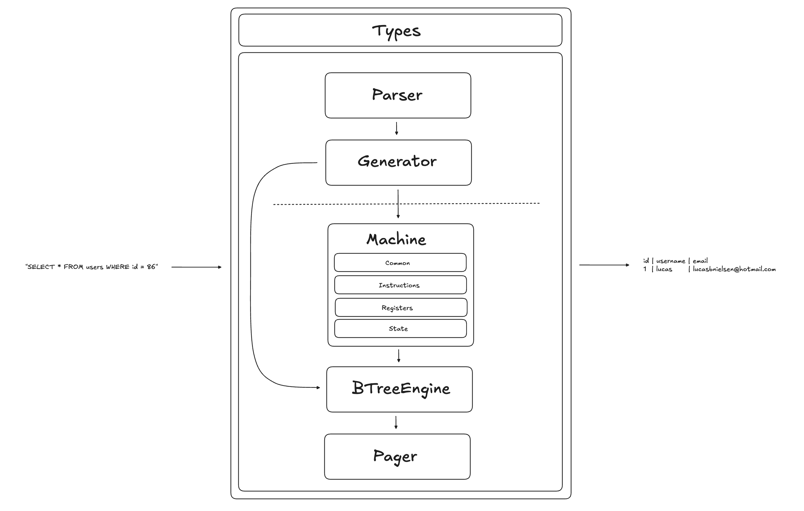

# SQLite3 Clone - A Serverless Single File Database

A simple SQL database engine written in Go, which reads and stores data on a
single file in the SQLite3 [file format](https://www.sqlite.org/fileformat.html#storage_of_the_sql_database_schema).

You can run the database engine with the following command:

```
./sqlite sample.db
```

This project is in it's early stages of development, which means that it does
not support many features.

The section on architecture below will go into more depth about the various
layers that make up the engine, but at present there are only implementations
for the `Machine`, `BTreeEngine` and `Pager` layers.

This means that you cannot actually pass arbitrary SQL - the `Parser` and
`Generator` layers are mocked and return hard coded instructions.

# Architecture

### Birds Eye View



The image above is a visual depiction of the `DatabaseEngine`, which is
responsible for glueing together independent layers and providing an interface
for executing SQL statements and `meta` commands (e.g `.dbinfo`).

There are 5 layers: `Pager`, `BTreeEngine`, `Machine`, `Generator` and `Parser`. Each
of these layers is designed to be completely independent of other the layers. A
layer is responsible for defining the interface by which it expects to make calls
to another layer.

This means that layers are decoupled, and don't really on the implementation
details of any other layers.

In the future, I'd like to potentially create different implementations of some
layers and figure out a way to profile them (i.e compare CPU and memory usage).

There is a global package for `types` which contains an `Entry` which is a union
of a `null` value, a `string` and a `int`. These are the types of values that can
be stored in the database, which is a detail that only the `BTreeEngine` really
needs to be concerned with.

Therefore, we can initialise the `Machine` with a generic type `T` which represents
the 'output' type of the machine - the `Machine` can take any type here. However,
the `BTreeEngine` takes a generic type `T` that conforms to the following interface:

```go
type resultTypeConstructor[T any] interface {
    Number(uint64) T
    Text(string) T
    Null() T
}
```

This is the `BTreeEngine`'s way of saying 'I need you to provide me a type that
knows how to construct a `T` of of all of the values that I store'.

The intention here is to ensure that all layers are independent entities that don't
rely on external packages - they are valid packages in isolation that fulfill their
single responsiblity.

### Layer 1: Pager

The pager is responsible for efficiently reading and writing pages to/from a file,
and is not concerned with things like:

1. The contents of a page
2. The format of the file
3. The 'context' of the file (e.g a database)

It could be used as an interface for interacting with _any_ page-based file, and
conforms to the following interface:

```go
type Pager interface {
    Close() error
    PageSize() uint64
    ReservedSpace() uint64
    GetPage(pageNum uint64) ([]byte, error)
}
```

It can be instantied with the following constructor:

```go
func NewPager(filepath string, config PagerConfig) (*Pager, error)
```

where the `config` contains the page size and the number of reserved bytes at the
end of each page.

The pager has a cache, which is implemented as a hash map that relates page
numbers to a byte slice (which is the length of a page).

There's likely a huge number of optimisations that could be done here, and I'm
deliberately doing none of them now (other than the very simple cache described
above) because my primary aim is to get an end-to-end simple, extensible and
functional system.

### Layer 2: BTreeEngine

The BTreeEngine is responsible for providing an interface for callers to interact
with B-Tree structures encoded by the database file.

```go
type BTreeEngine[T any] interface {
    NewCursor(id uint64, rootPageNum uint64) (bool, error)
    RewindCursor(id uint64) (bool, error)
    AdvanceCursor(id uint64) (bool, error)
    ReadColumn(id uint64, column uint64) (T, error)
}
```

This is done through 'cursors' which are pointers to a particular entry in a
B-Tree.

When a cursor is initialised with `NewCursor()` it points to the first byte on
the root page, and is set to point at the first B-Tree entry via the `RewindCursor()`
function. `AdvanceCursor()` moves the cursor along to the next entry, and `ReadColumn()`
reads a particular column in the entry that is currently being pointed to.

This is the only layer that knows about the SQLite3 file format, which means that
this is the only layer that would need to change if the file format were to change.

### Layer 3: Machine

TODO

### Layer 4: Bytecode Generator

TODO

### Layer 5: Parser

TODO

# Useful links

- [SQLite3 File Format](https://www.sqlite.org/fileformat.html#storage_of_the_sql_database_schema)
- [SQLite3 Opcodes](https://www.sqlite.org/opcode.html)
